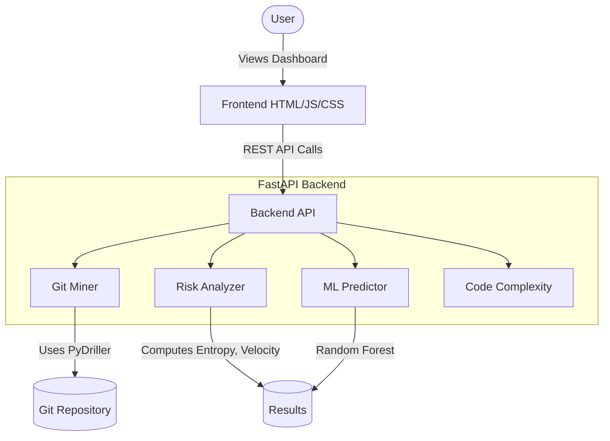

# 🔮 Software Change Predictor

> AI-Powered Defect Risk Analysis Engine for Software Repositories
> 
> 🌍 **Live Demo:** [https://software-change-predictor-lflp.onrender.com/](https://software-change-predictor-lflp.onrender.com/)


---

## 📖 Project Description
The **Software Change Predictor** is a powerful analytical tool designed to mine Git repository histories and compute defect risk metrics. By analyzing commit history, developer collaboration, and code changes, it identifies the most risky parts of a codebase. This tool helps QA engineers, project managers, and developers prioritize their refactoring and testing efforts.

## ✨ Key Features
- 📊 **Comprehensive Risk Metrics**: Analyzes Shannon entropy, change velocity, bug ratio, and more.
- 🚀 **High Performance Backend**: Powered by FastAPI and PyDriller for rapid Git mining.
- 🤖 **Machine Learning Integration**: Uses scikit-learn models to predict defect probability.
- 🎨 **Beautiful Dashboard**: Stunning dark-themed frontend with Chart.js visualizations.
- 🔌 **REST API Ready**: Fully documented REST API endpoints for CI/CD integration.

## 🖼 Screenshots
*Dashboard screenshot coming soon...*
*Risk analysis breakdown coming soon...*
*Commit velocity graphs coming soon...*

## 🏗 Architecture



## 🛠 Tech Stack

| Component | Technology | Description |
|-----------|------------|-------------|
| **Backend** | Python 3.9+, FastAPI | High-performance API server |
| **Mining** | PyDriller | Git history extraction |
| **Analysis** | pandas, numpy, scipy | Data processing & statistics |
| **ML Models** | scikit-learn | Defect prediction |
| **Frontend** | HTML5, CSS3, JS (ES6) | User interface |
| **Charts** | Chart.js | Data visualization |
| **Testing** | pytest | Unit and integration testing |

## 🚀 Quick Start / Installation

### 1. Clone Repository
```bash
git clone https://github.com/your-username/software-change-predictor.git
cd software-change-predictor
```

### 2. Install Dependencies
```bash
pip install -r requirements.txt
```

### 3. Start Backend Server
```bash
python -m backend.api
```

### 4. Open Dashboard
Open `frontend/index.html` in your favorite web browser.

## 💻 CLI Usage

You can also run the tool directly from the command line without the web dashboard:
```bash
python main.py --repo https://github.com/example/repo --top-n 10
```

## 📚 API Documentation

| Endpoint | Method | Description |
|----------|--------|-------------|
| `/analyze` | `POST` | Analyze a repository and generate risk metrics |
| `/health` | `GET` | Check API server health status |
| `/api/info` | `GET` | Get version and status information |
| `/export/csv`| `POST` | Export analysis results to CSV format |

*See `docs/api_reference.md` for complete API documentation.*

## 📂 Project Structure

```text
software-change-predictor/
├── backend/
│   ├── api.py           # FastAPI application
│   ├── analyzer.py      # Risk metrics computation
│   ├── miner.py         # PyDriller repository mining
│   ├── predictor.py     # ML prediction models
│   └── complexity.py    # Code complexity metrics
├── frontend/
│   ├── index.html       # Main dashboard
│   ├── styles.css       # CSS styling
│   └── app.js           # Frontend logic
├── docs/                # Project documentation
├── tests/               # Pytest suite
├── main.py              # CLI entry point
├── requirements.txt     # Python dependencies
└── README.md            # Project documentation
```

## 🧠 Algorithms

### Shannon Entropy
Measures the distribution of changes across a file over time. High entropy means changes are scattered and unpredictable.
```
H(X) = -Σ P(x) * log2(P(x))
```

### Composite Risk Score
A weighted combination of various risk factors:
```
Risk = (0.35 * Entropy) + (0.25 * BugRatio) + (0.20 * Velocity) + (0.15 * Complexity) + (0.05 * AuthorCoupling)
```

### ML Prediction Approach
We use a Random Forest Classifier trained on historical bug data and churn metrics to predict the probability of future defects in source code files.

## 👥 Team Members
This project was developed by:
- **Anshika**
- **Bhavya**
- **Akshita**
- **Harshita**
- **Harshita**

## 🤝 Contributing
Contributions, issues, and feature requests are welcome!
1. Fork the project
2. Create your feature branch (`git checkout -b feature/AmazingFeature`)
3. Commit your changes (`git commit -m 'Add some AmazingFeature'`)
4. Push to the branch (`git push origin feature/AmazingFeature`)
5. Open a Pull Request

## 📜 License
Distributed under the MIT License. See `LICENSE` for more information.

## 🙏 Acknowledgments
- PyDriller for excellent Git mining capabilities
- FastAPI for the blisteringly fast backend framework
- Chart.js for the responsive charts
