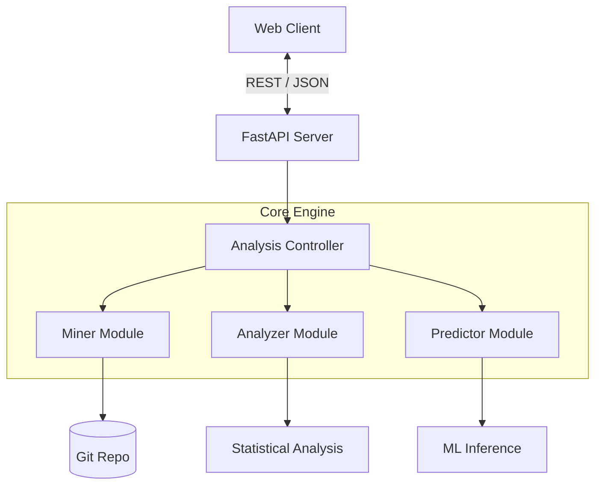
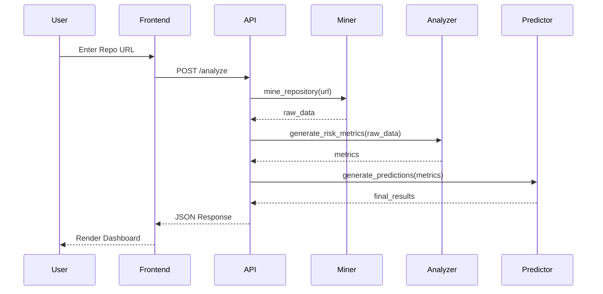

# System Architecture

## Overview
The Software Change Predictor is designed as a decoupled architecture consisting of a Python-based analysis engine (backend) and a lightweight web dashboard (frontend).

## Data Flow
1. **Mining Phase:** The system extracts raw commit logs, modifications, and author data from the Git repository.
2. **Analysis Phase:** Raw data is converted into statistical features (Entropy, Velocity).
3. **Prediction Phase:** Computed features are passed to the ML models to generate defect probabilities.
4. **Visualization:** The FastAPI backend returns JSON results, which the frontend renders as interactive charts.

## Module Descriptions
- **Miner (`backend.miner`)**: Uses PyDriller to traverse commits, extract file modifications, and parse commit messages for bug-related keywords.
- **Analyzer (`backend.analyzer`)**: Responsible for mathematical computations. Processes churn data to produce risk metrics.
- **Predictor (`backend.predictor`)**: Wraps scikit-learn classifiers. Provides risk classification thresholds and trend analysis.
- **Complexity (`backend.complexity`)**: Calculates cyclomatic complexity and SLOC metrics.

## Algorithm Deep-Dives

### Shannon Entropy
**Formula:** `H = -sum(p * log2(p))` where `p` is the proportion of a file's churn occurring in a given commit.
**Meaning:** High entropy indicates a file is modified in many small chunks across time, which often correlates with higher defect density. Low entropy means modifications happen in fewer, larger bursts.

### Change Velocity
Calculated using an Exponential Moving Average (EMA) of churn over weekly resampling periods. It emphasizes recent changes over historical ones, identifying "hot" files.

### Composite Risk
**Formula:** `Risk = (0.35 * Entropy) + (0.25 * BugRatio) + (0.20 * Velocity) + (0.15 * Complexity) + (0.05 * AuthorCoupling)`
**Justification:** Entropy is weighted highest as historical change scattering is the strongest predictor of future bugs.

### Gini Coefficient
Measures the inequality of contributions across different authors for a file. High Gini means one author dominates; low Gini means many authors touch the file (often increasing risk).

### ML Prediction
The system uses a Random Forest classifier. Feature engineering involves scaling entropy, velocity, and complexity metrics.

## Risk Classification Thresholds
| Level | Score Range | Description |
|-------|-------------|-------------|
| **Critical** | `0.75 - 1.00` | Immediate attention required, high bug probability. |
| **High** | `0.50 - 0.74` | Significant risk, review recommended. |
| **Medium** | `0.25 - 0.49` | Normal modification risk. |
| **Low** | `0.00 - 0.24` | Stable, low risk of defects. |

## Sequence Diagram

